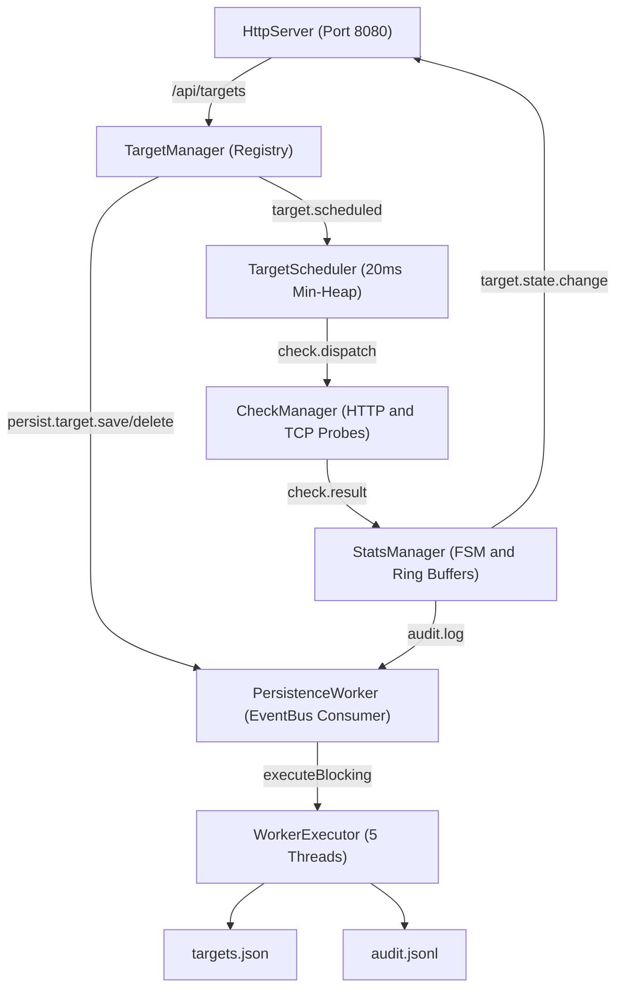

# High-Throughput Network Monitoring Service

A high-performance, non-blocking network monitoring service built with **Java 21** and **Eclipse Vert.x 5.0.0**. Designed to monitor 5,000+ HTTP and TCP targets at 1-second intervals with sub-millisecond dispatch jitter, zero Event Loop thread blocking, and low memory overhead under a 1 GB heap limit (`-Xmx1g`).

---

## Quick Start (One Command)

### Prerequisites
- **Java 21** (JDK 21+)
- **Maven 3.8+**

### 1. Build Fat JAR
```bash
mvn clean package -DskipTests
```

### 2. Run the Service
```bash
java -jar target/monitoring-service-fat.jar
```

Or run directly with Maven:
```bash
mvn exec:java -Dexec.mainClass="com.monitoring.MainLauncher"
```

The service will start on `http://localhost:8080`.

---

## Web Dashboard & API

### Web Dashboard
Open your browser and navigate to:
```
http://localhost:8080/
```
The real-time dashboard provides live target statuses, latencies, failure counters, and active alert streams with automatic 2-second polling.

### REST API Endpoints

| Method | Endpoint | Description |
| :--- | :--- | :--- |
| `GET` | `/health` | Service health status |
| `GET` | `/api/targets` | List all monitored targets |
| `POST` | `/api/targets` | Register a new target (single or array bulk) |
| `DELETE` | `/api/targets/:id` | Remove a target by ID |
| `GET` | `/api/metrics` | Retrieve aggregated system & target metrics |
| `GET` | `/api/alerts` | List all active target alerts |

#### Example: Register an HTTP Target
```bash
curl -X POST http://localhost:8080/api/targets \
  -H "Content-Type: application/json" \
  -d '{
    "id": "prod-api-check",
    "type": "HTTP",
    "url": "https://api.github.com",
    "intervalSeconds": 5,
    "timeoutMs": 2000
  }'
```

#### Example: Register a TCP Target
```bash
curl -X POST http://localhost:8080/api/targets \
  -H "Content-Type: application/json" \
  -d '{
    "id": "database-tcp-check",
    "type": "TCP",
    "host": "127.0.0.1",
    "port": 5432,
    "intervalSeconds": 10,
    "timeoutMs": 1000
  }'
```

---

## Architecture Overview

The system uses an asynchronous, event-driven actor model powered by the Vert.x EventBus.



### Visual Architecture Flow
```text
 +-----------------------------------------------------------------------+
 |                         REST & Static UI Layer                        |
 |                     HttpServer (Port 8080, 2 instances)               |
 +-----------------------------------+-----------------------------------+
                                     |  /api/targets
                                     v
 +-----------------------------------------------------------------------+
 |                         Reactive Core Engine                          |
 |                                                                       |
 |   +-----------------+   target.scheduled   +----------------------+   |
 |   |  TargetManager  | -------------------> |   TargetScheduler    |   |
 |   | (Registry CRUD) |                      | (20ms Tick Min-Heap) |   |
 |   +--------+--------+                      +----------+-----------+   |
 |            |                                          |               |
 |            |                                          | check.dispatch|
 |            | persist.target.save/delete               v               |
 |            |                               +----------------------+   |
 |            |                               |     CheckManager     |   |
 |            |                               |  (HTTP & TCP Probes) |   |
 |            |                               +----------+-----------+   |
 |            |                                          |               |
 |            |                                          | check.result  |
 |            |                                          v               |
 |            |                               +----------------------+   |
 |            |           audit.log           |     StatsManager     |   |
 |            |      +----------------------- | (Ring Buffers & FSM) |   |
 |            |      |                        +----------------------+   |
 +------------|------|---------------------------------------------------+
              |      |
              v      v
 +-----------------------------------------------------------------------+
 |                    Persistence & Audit Layer                          |
 |                                                                       |
 |   +---------------------------------------------------------------+   |
 |   |          PersistenceWorker (EventBus Message Consumer)        |   |
 |   +-------------------------------+-------------------------------+   |
 |                                   | executeBlocking                   |
 |                                   v                                   |
 |   +---------------------------------------------------------------+   |
 |   |         Dedicated WorkerExecutor Pool (5 Threads)             |   |
 |   +---------------+-------------------------------+---------------+   |
 |                   |                               |                   |
 |                   v                               v                   |
 |           [ targets.json ]                [ audit.jsonl ]             |
 +-----------------------------------------------------------------------+
```

---

## Running the Automated Test Suite

Run all unit, mathematical engine, scheduler, alert FSM, and persistence integration tests:

```bash
mvn clean test
```

### Test Suite Summary (27 / 27 Passing)
- **`SlidingWindowStatsTest`**: Ring buffer insertion, zero-allocation rolling 1m / 5m averages, slot expiration.
- **`Slice1FoundationTest`**: Non-blocking HTTP and TCP probe executions, retry backoffs, REST CRUD APIs.
- **`Slice3SchedulerTest`**: Min-heap scheduling precision, 20ms tick timers, dynamic target interval rescheduling, lazy deletion.
- **`Slice4AlertsTest`**: Anti-flapping FSM hysteresis (3 failures $\rightarrow$ `CRITICAL`, 2 successes $\rightarrow$ `HEALTHY`, latency $\ge 1500\text{ms}$ $\rightarrow$ `DEGRADED`).
- **`Slice5PersistenceTest`**: Target JSON persistence, audit JSONL append flushing, and clean crash recovery on boot.
